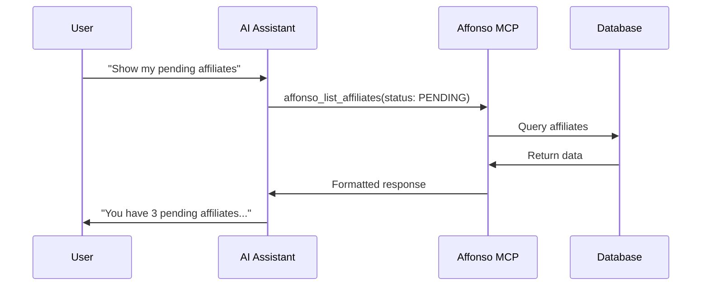

<Note>
**Beta Feature**: MCP integration is currently in beta and not available to all users yet. Interested in getting access? [Contact us](mailto:hello@affonso.io) to join the beta program.
</Note>

## What is MCP?

The **Model Context Protocol (MCP)** is an open standard that enables AI assistants like Claude, Cursor, and others to interact directly with external services. With Affonso's MCP integration, you can manage your affiliate program using natural language commands.

<Info>
MCP allows AI assistants to read and modify your affiliate data in real-time, making it perfect for quick queries, bulk operations, and automation workflows.
</Info>

## Why Use MCP?

<CardGroup cols={2}>
  <Card title="Natural Language" icon="comments">
    Ask questions like "Show me my top 5 affiliates by revenue" or "Create a new affiliate for john@example.com"
  </Card>
  <Card title="Real-Time Data" icon="bolt">
    Get instant access to your affiliate data without switching between tools
  </Card>
  <Card title="Bulk Operations" icon="layer-group">
    Perform complex operations across multiple affiliates, referrals, or commissions
  </Card>
  <Card title="AI-Powered Analysis" icon="brain">
    Let AI analyze your affiliate performance and provide insights
  </Card>
</CardGroup>

## Available Tools

Affonso MCP provides **18 tools** across 4 domains:

| Domain | Tools | Description |
|--------|-------|-------------|
| [Affiliates](/mcp/tools/affiliates) | 5 | List, get, create, update, delete affiliates |
| [Referrals](/mcp/tools/referrals) | 5 | Track clicks, leads, and conversions |
| [Commissions](/mcp/tools/commissions) | 5 | Manage commission transactions |
| [Payouts](/mcp/tools/payouts) | 3 | Process and track affiliate payouts |

## How It Works



1. **You ask** your AI assistant a question about your affiliates
2. **The AI** calls the appropriate Affonso MCP tool
3. **Affonso** authenticates and executes the request
4. **Results** are returned in a readable format

## MCP Endpoint

```
https://api.affonso.io/mcp
```

The MCP server uses **Streamable HTTP** transport, which is supported by Claude Desktop, Cursor, and other MCP-compatible clients.

## Authentication

MCP uses the same API keys as the REST API. You'll need a valid API key with appropriate permissions:

- **Production**: `sk_live_` + 32 characters
- **Development**: `sk_dev_` + 32 characters

<Warning>
Your API key has full access to your affiliate data. Never share it publicly or commit it to version control.
</Warning>

## Response Formats

All MCP tools support two response formats:

| Format | Best For |
|--------|----------|
| **Markdown** (default) | Human-readable output with formatting |
| **JSON** | Programmatic processing and detailed data |

Specify the format using the `responseFormat` parameter on any tool.

## Next Steps

<CardGroup cols={2}>
  <Card title="Claude Desktop Setup" icon="message-bot" href="/mcp/setup/claude-desktop">
    Configure MCP in Claude Desktop
  </Card>
  <Card title="Cursor Setup" icon="i-cursor" href="/mcp/setup/cursor">
    Set up MCP in Cursor IDE
  </Card>
  <Card title="View All Tools" icon="wrench" href="/mcp/tools/affiliates">
    Explore available MCP tools
  </Card>
  <Card title="Example Queries" icon="lightbulb" href="/mcp/examples">
    See sample prompts and use cases
  </Card>
</CardGroup>
