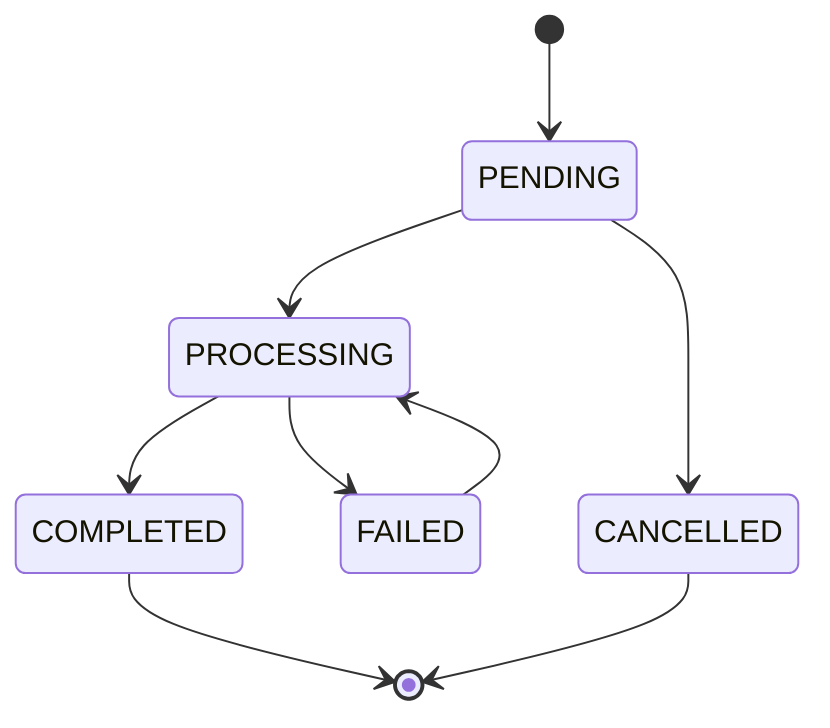

## Overview

The payout tools allow you to manage and track affiliate payouts. All tools support both **Markdown** and **JSON** response formats.

## Available Tools

| Tool | Description | Permission |
|------|-------------|------------|
| `affonso_list_payouts` | List payouts with filtering | `read:payouts` |
| `affonso_get_payout` | Get a single payout with details | `read:payouts` |
| `affonso_update_payout` | Update payout status | `write:payouts` |

<Info>
Payouts are typically created automatically when processing affiliate payments through the dashboard. Use these tools to track and update payout status.
</Info>

## Payout Statuses

| Status | Description |
|--------|-------------|
| `PENDING` | Payout created, awaiting processing |
| `PROCESSING` | Payout is being processed |
| `COMPLETED` | Payout successfully sent |
| `FAILED` | Payout failed to process |
| `CANCELLED` | Payout was cancelled |

---

## affonso_list_payouts

List and filter payouts.

### Parameters

<ParamField body="page" type="number" default="1">
  Page number for pagination
</ParamField>

<ParamField body="limit" type="number" default="50">
  Results per page (max 100)
</ParamField>

<ParamField body="affiliateId" type="string">
  Filter by affiliate ID
</ParamField>

<ParamField body="status" type="string">
  Filter by status: `PENDING`, `PROCESSING`, `COMPLETED`, `FAILED`, `CANCELLED`
</ParamField>

<ParamField body="startDate" type="string">
  Filter from date (ISO 8601)
</ParamField>

<ParamField body="endDate" type="string">
  Filter to date (ISO 8601)
</ParamField>

<ParamField body="responseFormat" type="string" default="markdown">
  Response format: `markdown` or `json`
</ParamField>

### Example Prompts

```
List all payouts
Show pending payouts
Get payouts for affiliate aff_abc123
Show completed payouts from last month
What payouts are processing right now?
```

### Response

<CodeGroup>
```markdown Markdown Format
## Payouts (Page 1 of 2)

### pay_abc123
- **Affiliate:** John Smith (aff_123)
- **Amount:** $500.00
- **Transactions:** 15
- **Status:** COMPLETED
- **Processed:** Jan 15, 2024

### pay_def456
- **Affiliate:** Jane Doe (aff_456)
- **Amount:** $250.00
- **Transactions:** 8
- **Status:** PENDING
- **Created:** Jan 14, 2024

---
**Total:** $750.00 across 2 payouts
```

```json JSON Format
{
  "payouts": [
    {
      "id": "pay_abc123",
      "affiliateId": "aff_123",
      "affiliateName": "John Smith",
      "amount": 50000,
      "transactionCount": 15,
      "status": "COMPLETED",
      "processedAt": "2024-01-15T10:00:00.000Z"
    }
  ],
  "pagination": {
    "page": 1,
    "limit": 50,
    "total": 10,
    "totalPages": 1
  },
  "summary": {
    "totalAmount": 75000
  }
}
```
</CodeGroup>

---

## affonso_get_payout

Get detailed information about a specific payout, including all associated transactions.

### Parameters

<ParamField body="id" type="string" required>
  The payout ID (starts with `pay_`)
</ParamField>

<ParamField body="responseFormat" type="string" default="markdown">
  Response format: `markdown` or `json`
</ParamField>

### Example Prompts

```
Get payout pay_abc123
Show details for payout pay_xyz789
What transactions are in payout pay_pending123
```

### Response

<CodeGroup>
```markdown Markdown Format
## Payout: pay_abc123

| Field | Value |
|-------|-------|
| Affiliate | John Smith (aff_123) |
| Amount | $500.00 |
| Status | COMPLETED |
| Method | Bank Transfer |
| Created | Jan 10, 2024 |
| Processed | Jan 15, 2024 |

### Included Transactions (15)

| ID | Amount | Sale | Date |
|----|--------|------|------|
| txn_001 | $35.00 | $350.00 | Jan 5 |
| txn_002 | $42.00 | $420.00 | Jan 6 |
| txn_003 | $28.00 | $280.00 | Jan 7 |
| ... and 12 more |

### Payment Details
- **Bank:** Chase Bank ****1234
- **Reference:** PAY-2024-001234
```

```json JSON Format
{
  "id": "pay_abc123",
  "affiliateId": "aff_123",
  "affiliateName": "John Smith",
  "amount": 50000,
  "status": "COMPLETED",
  "method": "bank_transfer",
  "transactions": [
    {
      "id": "txn_001",
      "amount": 3500,
      "saleAmount": 35000,
      "createdAt": "2024-01-05T10:00:00.000Z"
    }
  ],
  "transactionCount": 15,
  "createdAt": "2024-01-10T10:00:00.000Z",
  "processedAt": "2024-01-15T10:00:00.000Z"
}
```
</CodeGroup>

---

## affonso_update_payout

Update an existing payout's status.

### Parameters

<ParamField body="id" type="string" required>
  The payout ID to update
</ParamField>

<ParamField body="status" type="string" required>
  New status: `PROCESSING`, `COMPLETED`, `FAILED`, `CANCELLED`
</ParamField>

<ParamField body="notes" type="string">
  Notes about the status change
</ParamField>

<ParamField body="responseFormat" type="string" default="markdown">
  Response format: `markdown` or `json`
</ParamField>

### Example Prompts

```
Mark payout pay_abc123 as completed
Set payout pay_xyz to processing
Cancel payout pay_pending456
Mark payout pay_123 as failed with note "Bank rejected transfer"
```

### Response

```markdown
## Payout Updated

**pay_abc123** has been updated:
- Status: PENDING → COMPLETED

All included transactions have been marked as paid.
```

---

## Common Workflows

### Process Pending Payouts

```
1. "List all pending payouts"
2. "Get details for payout pay_abc123"
3. "Mark payout pay_abc123 as processing"
4. (Process payment externally)
5. "Mark payout pay_abc123 as completed"
```

### Review Affiliate Earnings

```
"Show all completed payouts for affiliate aff_abc123"
"What's the total paid to John Smith this year?"
"List failed payouts from last month"
```

### Monthly Payout Report

```
"Show all payouts from January 2024"
"What's the total amount paid out last month?"
"List affiliates with pending payouts over $100"
```

## Status Transitions



<Info>
Once a payout is `COMPLETED`, its status cannot be changed. Refunds should be handled as new commission adjustments.
</Info>

## Error Handling

| Error | Cause | Solution |
|-------|-------|----------|
| `NOT_FOUND` | Payout ID doesn't exist | Verify the ID is correct |
| `ALREADY_COMPLETED` | Cannot modify completed payout | Create a refund/adjustment instead |
| `INVALID_TRANSITION` | Invalid status change | Check allowed status transitions |
| `PERMISSION_DENIED` | Missing required scope | Check your API key permissions |
