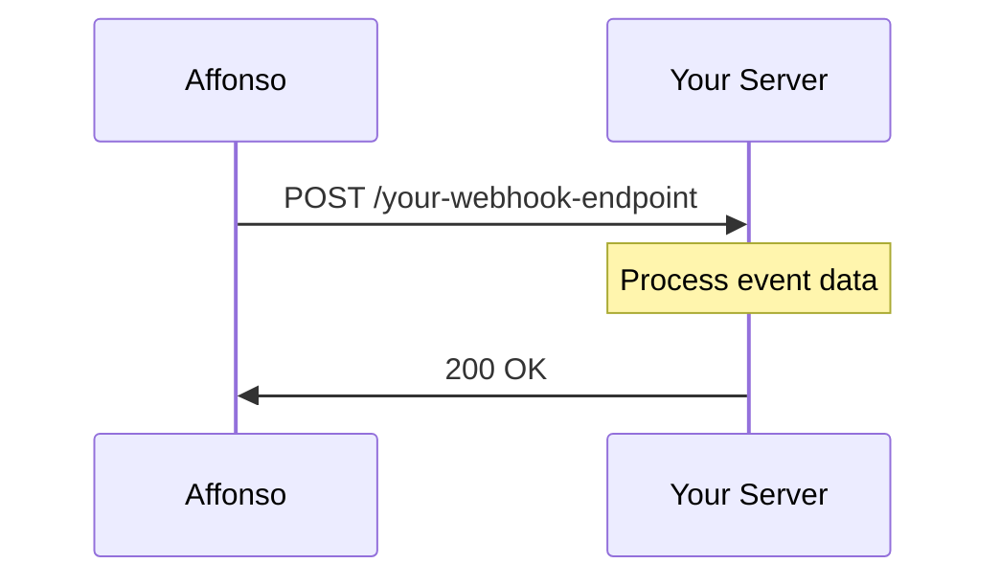

## What are Webhooks?

Webhooks allow you to receive real-time HTTP notifications when events occur in your Affonso affiliate program. Instead of polling our API for changes, webhooks push data to your server the moment something happens.

## How Webhooks Work



1. **Event occurs** - An affiliate signs up, a referral converts, a commission is paid, etc.
2. **Affonso sends a POST request** - We send a JSON payload to your configured endpoint
3. **Your server processes the event** - Handle the data as needed
4. **Respond with 200 OK** - Confirm receipt of the webhook

## Event Categories

<CardGroup cols={2}>
  <Card title="Affiliate Events" icon="user-plus" href="/webhooks/events/affiliate">
    Track when affiliates sign up, get approved, or update their details
  </Card>
  <Card title="Referral Events" icon="link" href="/webhooks/events/referral">
    Monitor referral clicks, leads, and conversions
  </Card>
  <Card title="Transaction Events" icon="receipt" href="/webhooks/events/transaction">
    Get notified about sales, commissions, and refunds
  </Card>
  <Card title="Payout Events" icon="money-bill-transfer" href="/webhooks/events/payout">
    Track affiliate payouts and payment status
  </Card>
</CardGroup>

## Security

All webhook requests include a signature header for verification:

```
X-Affonso-Signature: sha256=...
```

We sign each payload using HMAC-SHA256 with your webhook secret. Always verify this signature before processing webhook data.

## Retry Policy

If your endpoint doesn't respond with a `2xx` status code, we'll retry the webhook with exponential backoff:

| Attempt | Delay |
|---------|-------|
| 1 | Immediate |
| 2 | 1 minute |
| 3 | 5 minutes |
| 4 | 30 minutes |
| 5 | 2 hours |

After 5 failed attempts, the webhook delivery is marked as failed.

## Payload Structure

All webhook payloads follow a consistent structure:

```json
{
  "id": "evt_abc123",
  "type": "referral.converted",
  "createdAt": "2024-01-15T10:30:00.000Z",
  "data": {
    // Event-specific data
  }
}
```

| Field | Description |
|-------|-------------|
| `id` | Unique event identifier |
| `type` | The event type (e.g., `affiliate.created`) |
| `createdAt` | ISO 8601 timestamp of when the event occurred |
| `data` | Event-specific payload data |

## Next Steps

<CardGroup cols={2}>
  <Card title="Set Up Webhooks" icon="gear" href="/webhooks/setup">
    Configure webhook endpoints in your dashboard
  </Card>
  <Card title="Code Examples" icon="code" href="/webhooks/examples">
    Implementation examples in various languages
  </Card>
</CardGroup>

